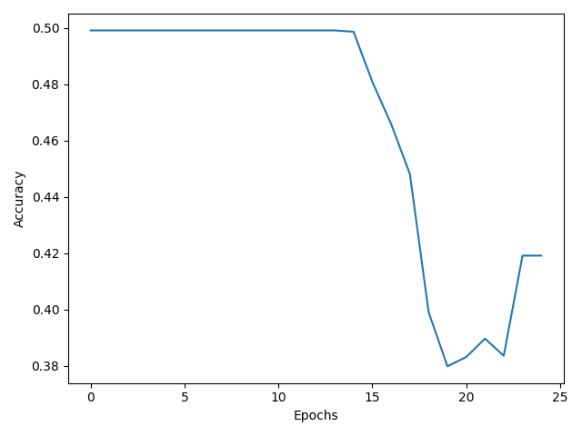
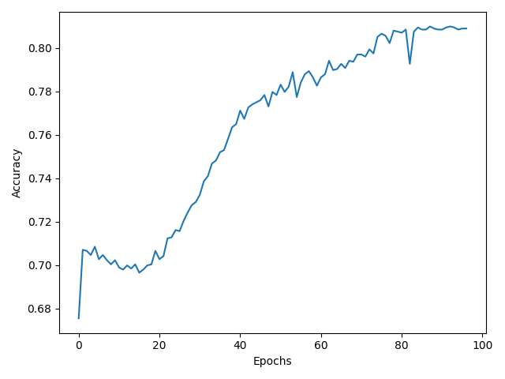
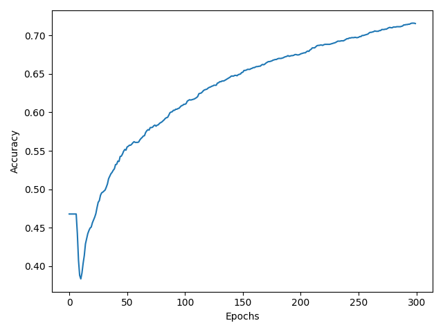
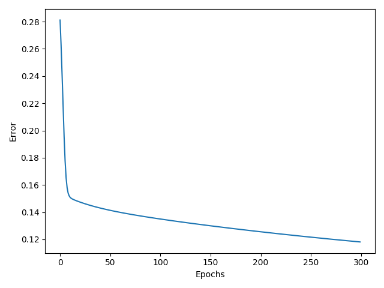

# MVPClassifier
Use a simple perceptron neural network to predict NBA mvps with tournament algorithm

### Classifier performance


This plot shows classifier performance over 300 epochs. The error value is calculated from the least squares
method between the normalized mvp shares between 2 players. However classifying mvp share is very difficult given player stats
as other factors such as narrative apply. However with the given data and features, this classifier should be able to predict which player is better.
The following plot shows the performance given the task of classifying the better player.


Unfortunately this did not work. The training did not converge in accuracy. Although it seems the loss functions has converged seamlessly, it turns out
that the model outputs a number close to 0.5, thus acts as the average middle value between all outputs resulting in minimal error. 

### Prototyping

After my original model failing, I was ensure if the data I was providing was faulty or was it the 
model implementation. To find out, I wrote an equivalent model using the library sci-kit learn to get an upper bound
for the accuracy of my model. After writing my sci-kit model, I tested it on my dataset and the result was the same
where it picked a value close to 0.5 to minimize error thus again resulting in an accuracy similiar to random chance. I fixed this by normalizing my sample data

```python
# old data sample
sample1 = [player1stat1, player1stat2, ... , player1statn, player2stat2, ... player2statn]

def normalize(x, y):
    return x/x+y

# new data sample
sample1 = [ normalize(player1stat1, player2stat1) , ... , normalize(player1statn, player2statn)]
```
#### Before normalization



#### After normalization



Now after fixing the data to achieve competent results on the sci-kit model. I decided to test it on my model which
was a Single perceptron trained with my own implementation of the gradient descent algorithm. These were the results.




After training the model, we simulate of tournament between players
and our model evaluates which player is more likely to be MVP. 

Here are the results

| Season                 | Prediction    | MVP Winner            |
|:----------------------:|:-------------:| :--------------------:|
| 2020-2021 (Unfinished) | Nikola Jokić  | Not determined        |
| 2019-2020              | James Harden  | Giannis Antetokounmpo |
| 2018-2019              | James Harden  | Giannis Antetokounmpo |
| 2017-2018              | Lebron James  | James Harden          |
| 2016-2017              | James Harden  | Russel WestBrook      |
| 2015-2016              | Stephen Curry | Stephen Curry         |
| 2014-2015              | James Harden  | Stephen Curry         |

Interesting enough, this model seems to prefer James Harden alot, and suggest
it favors box-score statistics over games. This is understandable since most of parameters
are related to personal statistics rather than team wins. Interestingly enough
the year James Harden won the MVP, my model predicted LeBron James instead. Although
this model did not predict the MVP as accurately as I would have hoped,
the players is suggested are definitely mvp debatable, for example James
Harden was a perennial top MVP candidate for his box score stats, and this model
clearly reflected that.