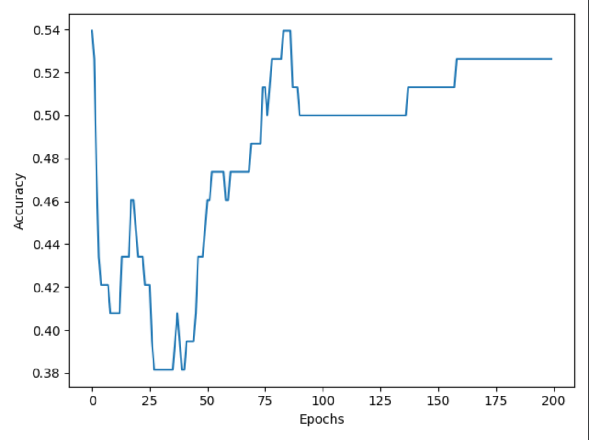
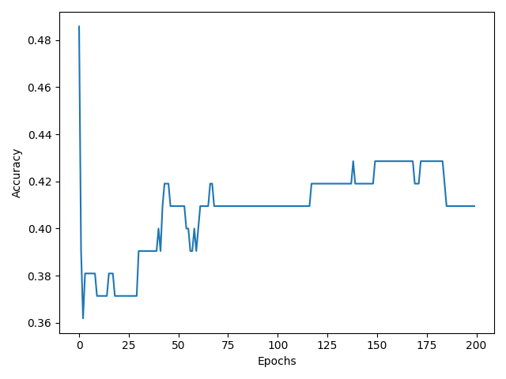
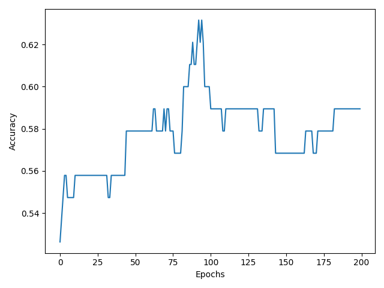

# MVPClassifier
Use a simple perceptron neural network to predict NBA mvps with tournament algorithm

### Classifier performance

This plot shows classifier performance over 300 epochs. The error value is calculated from the least squares
method between the normalized mvp shares between 2 players. However classifying mvp share is very difficult given player stats
as other factors such as narrative apply. However with the given data and features, this classifier should be able to predict which player is better.
The following plot shows the performance given the task of classifying the better player.

Unfortunately this did not work as planned. I trained model again with a smaller subset of the dataset as well as less epochs to
to view how my model improves over iterations. After training it 3 times, it seems training does not imrpove the model's anility to classify the better. I suspect this is due
to the model minimizing error by selecting values close to the middle to minimize error.